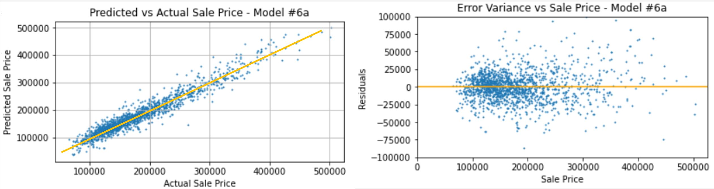
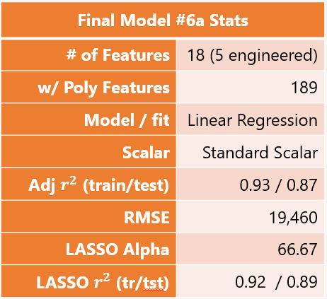

---
# AMES Housing Price Modeling

#### Ryan McDonald
---
### Problem Statement
Story County requires Property Tax Equalization to occur every 2 years. Ames, IA is the most populated community in the county. Tax assessment rates have not increased in nearly a dacade.
We have been tasked to:

1. Develop opensource tools for County Assessors to utilize for home value assessments for Ames, IA

2. Provide insights on most value-added characteristics to aid potential homeowners when placing offers on Residential homes or selecting a sales price.
 

---
## Executive Summary
**Provided housing dataset was intensively reviewed, analyzed and adapted into a running predictor model.  Several key findings were interpretted from the modeling:**
   
   -  Housing prices, on average, decreased year over year from the data provided.  This data was derived during the Housing Crisis and does not reflect current, or typical housing price changes (on average ~3% annual increase). 
        
        -  Basic linear regression models were produced using singluar features (overall quality and total finish square footage).  These models produced much better results in comparisson to the 'null' model by nearly 8x.
        
        - More complex modeling with several transformations proved to provide even more reliable predictions accounting for nearly 90% of the variance in sales prices.
           
           **Production model consists of 18 housing features (5 of which were engineered). These features were expanded by introducing polynomial-based interaction terms. Further scaling through StandardScalar transformation and bias introduction with LASSO Regularization fine-tuned the  production model to produce excellent results!** 
  
   -  Overall quality of home features were determined to be the most inportant factor for determing accurate sale prices of homes.  Interaction terms containing a 'quality' metric also proved valuable. 

---
### Data Description
Data utilized for the project analysis was obtained through the Ames, Iowa assessors office. 

Dataset contains 82 columns which include 23 nominal, 23 ordinal, 14 discrete, and 20 continuous variables.  Each variable represents a 'feature' of the home.  There are 2930 seperate observations that range in sales data between 2006 and 2010:

Data Dictionary created for datasets utilized in this analysis (click to expand)

| Column Name     | Data Type | Description                                       |
|-----------------|-----------|---------------------------------------------------|
| Id              | int64     | Observation number                                |
| PID             | int64     | Parcel identification number                      |
| MS SubClass     | int64     | type of dwelling                                  |
| MS Zoning       | object    | zoning classification                             |
| Lot Frontage    | float64   | Linear feet of street                             |
| Lot Area        | int64     | Lot size in square feet                           |
| Street          | object    | Type of road access                               |
| Alley           | object    | Type of alley access                              |
| Lot Shape       | object    | General shape of property                         |
| Land Contour    | object    | Flatness of the property                          |
| Utilities       | object    | Type of utilities available                       |
| Lot Config      | object    | Lot configuration                                 |
| Land Slope      | object    | Slope of property                                 |
| Neighborhood    | object    | locations within Ames                             |
| Condition 1     | object    | proximity to various condition                    |
| Condition 2     | object    | Proximity to various conditions                   |
| Bldg Type       | object    | Type of dwelling                                  |
| House Style     | object    | Style of dwelling                                 |
| Overall Qual    | int64     | Rates the overall material and finish             |
| Overall Cond    | int64     | Rates the overall condition                       |
| Year Built      | int64     | Original construction date                        |
| Year Remod/Add  | int64     | Remodel date                                      |
| Roof Style      | object    | Type of roof                                      |
| Roof Matl       | object    | Roof material                                     |
| Exterior 1st    | object    | Exterior covering on house                        |
| Exterior 2nd    | object    | Exterior covering on house                        |
| Mas Vnr Type    | object    | Masonry veneer type                               |
| Mas Vnr Area    | float64   | Masonry veneer area in square feet                |
| Exter Qual      | object    | quality of the material on the exterior           |
| Exter Cond      | object    | present condition of the material on the exterior |
| Foundation      | object    | Type of foundation                                |
| Bsmt Qual       | object    | height of the basement                            |
| Bsmt Cond       | object    | condition of the basement                         |
| Bsmt Exposure   | object    | walkout or garden level walls                     |
| BsmtFin Type 1  | object    | Rating of basement finished area                  |
| BsmtFin SF 1    | float64   | type 1 finished square feet                       |
| BsmtFin Type 2  | object    | Rating of basement finished area                  |
| BsmtFin SF 2    | float64   | Type 2 finished square feet                       |
| Bsmt Unf SF     | float64   | Unfinished square feet of basement area           |
| Total Bsmt SF   | float64   | Total square feet of basement area                |
| Heating         | object    | Type of heating                                   |
| Heating QC      | object    | Heating quality and condition                     |
| Central Air     | object    | Central air conditioning                          |
| Electrical      | object    | Electrical system                                 |
| 1st Flr SF      | int64     | First Floor square feet                           |
| 2nd Flr SF      | int64     | Second floor square feet                          |
| Low Qual Fin SF | int64     | Low quality finished square feet (all floors)     |
| Gr Liv Area     | int64     | Above grade (ground) living area square feet      |
| Bsmt Full Bath  | float64   | Basement full bathrooms                           |
| Bsmt Half Bath  | float64   | Basement half bathrooms                           |
| Full Bath       | int64     | Full bathrooms above grade                        |
| Half Bath       | int64     | Half baths above grade                            |
| Bedroom AbvGr   | int64     | Bedrooms above grade                              |
| Kitchen AbvGr   | int64     | Kitchens above grade                              |
| Kitchen Qual    | object    | Kitchen quality                                   |
| TotRms AbvGrd   | int64     | Total rooms above grade                           |
| Functional      | object    | Home functionality                                |
| Fireplaces      | int64     | Number of fireplaces                              |
| Fireplace Qu    | object    | Fireplace quality                                 |
| Garage Type     | object    | Garage location                                   |
| Garage Yr Blt   | float64   | Year garage was built                             |
| Garage Finish   | object    | Interior finish of the garage                     |
| Garage Cars     | float64   | Size of garage in car capacity                    |
| Garage Area     | float64   | Size of garage in square feet                     |
| Garage Qual     | object    | Garage quality                                    |
| Garage Cond     | object    | Garage condition                                  |
| Paved Drive     | object    | Paved driveway                                    |
| Wood Deck SF    | int64     | Wood deck area in square feet                     |
| Open Porch SF   | int64     | Open porch area in square feet                    |
| Enclosed Porch  | int64     | Enclosed porch area in square feet                |
| 3Ssn Porch      | int64     | Three season porch area in square feet            |
| Screen Porch    | int64     | Screen porch area in square feet                  |
| Pool Area       | int64     | Pool area in square feet                          |
| Pool QC         | object    | Pool quality                                      |
| Fence           | object    | Fence quality                                     |
| Misc Feature    | object    | Miscellaneous feature not covered in other cats   |
| Misc Val        | int64     | Value (dollar) of miscellaneous feature                   |
| Mo Sold         | int64     | Month Sold (MM)                                   |
| Yr Sold         | int64     | Year Sold (YYYY)                                  |
| Sale Type       | object    | Type of sale                                      |
| SalePrice       | int64     | Sale price (dollar)                                      |

 
 

 
**The following databases were utilized in analysis:**

| Database Utilized         	| Features with Database                           	|
|---------------------------	|--------------------------------------------------	|
| Pandas                    	|                                                  	|
| Missingno                 	| msno                                             	|
| Numpy                     	|                                                  	|
| Seaborn                   	|                                                  	|
| Matplotlib                	| pyplot                                           	|
| SKLearn - metrics         	| r2_score                                         	|
| SKLearn - linear_model    	| LinearRegression, Lasso, LassoCV, Ridge, RidgeCV 	|
| SKLearn - model_selection 	| train_test_split, cross_val_score                	|
| SKLearn - preprocessing   	| PolynomialFeatures, StandardScalar              	|

---      
### Analysis

1. All utilized datasets were cleaned and modified to provide the needed information to complete the problem statement.
2. Additional, Engineered Features were added to better interpret 'object'-type data and to better take advantage of avaiable data features. Several of these engineered features were utilized in modeling and predictions.
  
  -  Preparred models grew in complxity and accuracy.
  
  -  Some models contained transformations and scaling to better manipulate the data to provide accurate results. 
  
  -  Final results for Model #6a are below showing residuals and predicted sale price plotted against actual sale price.

   -  Table representing baseline statistics of Model #6a below:

 

3.  Additional supporting analysis is provided in the code notebook for review, as well as additional insights. Indepth and detailed processing and review are featured throughout code notebooking within markdown and code- formatted lines. 

---
### Conclusions and Recommendations

**Based on an analysis of the data above, there are several conclusion that can be determined:**
   
   -  Although accuracies may vary based on new test data, Model #6a will be submitted to the Story County Assessors Office for review. This model was able to represent variance in sale price nearly 90% of the time. Further modification to the model can be made in order to utilize in different cities as well. 

     
   -  Homeowners looking to buy or sell a home in Ames, IA should focus efforts on overall quality of features in the home.  This will net the greatest increase in value.  Total finished square footage and garage size would be the next characteristics to work on.  Location will be important as well. The only neighborhoods with mean sales price above $300k are North Ridge Heights and North Ridge.
  
